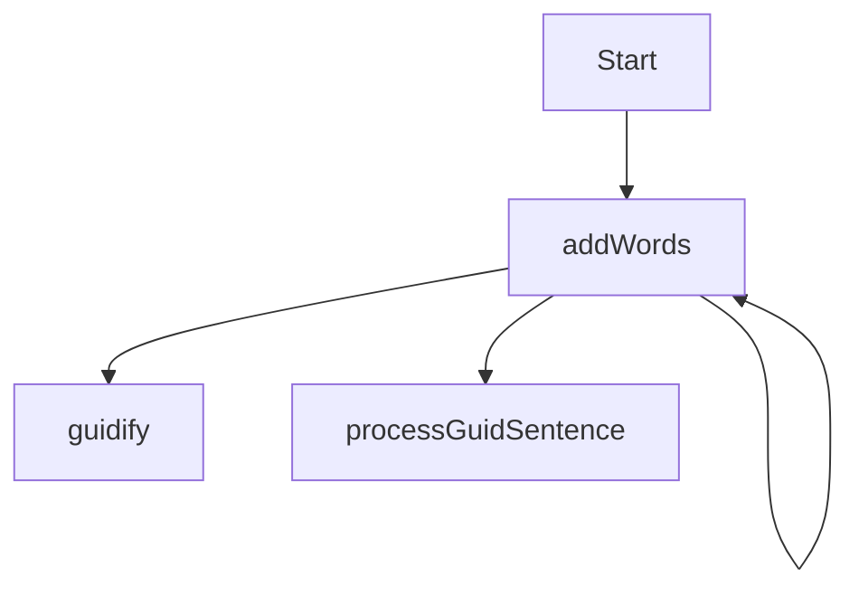

# bawdyGUID
Python script to generate GUIDs with words, looking for bawdy text. Also an excuse to kick the tires on python. An uninterrupted run is **s** to the **l** to the **o** to the **w**.

## guts
Recurse through an english dictionary and add words along with 1337 substitutions. 1337 substitutions are iterated through and every combination is applied (see *guidify*). *processGuidSentence* receives each GUID 'sentence' and outputs a dict of the sentence and attributes (are our words aligned on GUID dashes, etc.), so subjective judgements can be made (would a screen cap of that be a dict pic?).

## notes
- guid word sounds like squidward. that's a feature.
- it's pronounced [gwid, not goo-id](https://docs.google.com/forms/d/1YV-fP7hhEUssx-u9o1hlI9o7Lljy5dRkf7hvEyO2t0Y). fight me. 